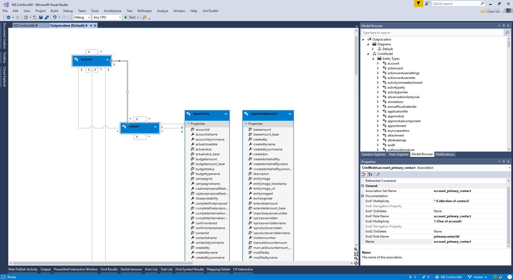
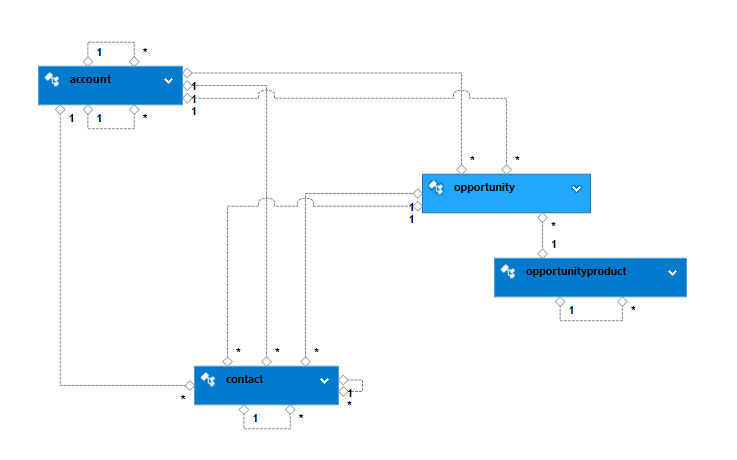
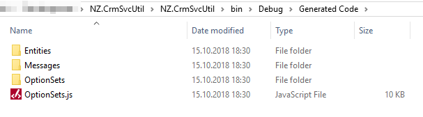
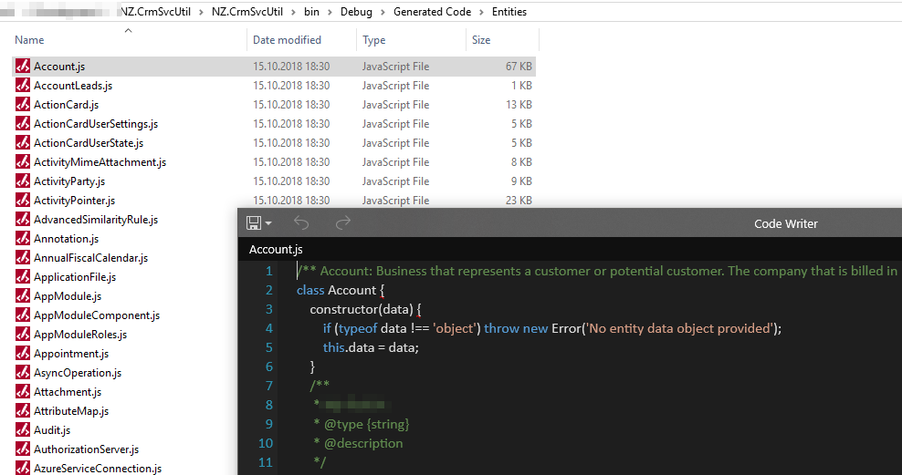
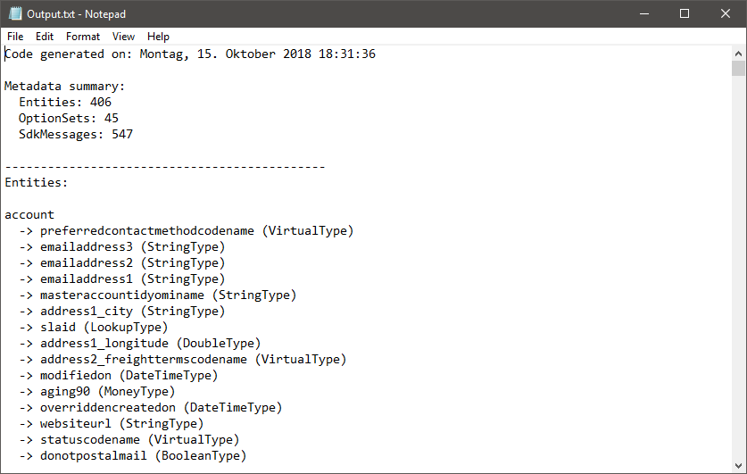

# NZ.CrmSvcUtil

Some extensions for the `CrmSvcUtil` command line tool shipped with the CRM SDK Core Tools package I wrote a while back.

`CrmSvcUtil` is a handy, extensible and easy to use tool for deriving any kind of artifacts based on CRM organization metadata. While many know it as _the_ standard way for generating early-bound type definitions, I believe that only a few understand and it's inner (extension-) mechanism and comprehend how powerful it can be. At least I did undererstimate it before. ;-)

Note: While the code generators *just work* as they are, they have a rather "proof of concept" quality/character. That's why I did not respect any `ICodeWriterFilterService` used by CrmSvcUtil.

## Included code generators

- `NZ.CrmSvcUtil.Strategy.Text.CodeGenerationService`
- `NZ.CrmSvcUtil.Strategy.JavaScript.CodeGenerationService`
- `NZ.CrmSvcUtil.Strategy.Edm.CodeGenerationService`

### NZ.CrmSvcUtil.Strategy.Text.CodeGenerationService

Just prints a textual overview of all metadata items as outline list. Kind of "Hello World!".

### NZ.CrmSvcUtil.Strategy.JavaScript.CodeGenerationService

Generate some simple ES6 class definitions for all entities and sdk messages.

### NZ.CrmSvcUtil.Strategy.Edm.CodeGenerationService

Generate a EDMX file for all entities including relationships. This EDMX file can then be viewed using the Edm Model Viewer contained in the *Entity Framework Tools* extension for VS (upt to VS2017).

# How to use it

## Generate EDMX file

```ps
CrmSvcUtil.exe /codegenerationservice:"NZ.CrmSvcUtil.Strategy.Edm.CodeGenerationService,NZ.CrmSvcUtil" /out:Output.edmx /interactivelogin
```

## Generate JS class files

```ps
CrmSvcUtil.exe /codegenerationservice:"NZ.CrmSvcUtil.Strategy.JavaScript.CodeGenerationService,NZ.CrmSvcUtil" /out:Output.js /interactivelogin /separatefiles
```


## Generate text outlines

```ps
CrmSvcUtil.exe /codegenerationservice:"NZ.CrmSvcUtil.Strategy.Text.CodeGenerationService,NZ.CrmSvcUtil" /out:Output.js /interactivelogin /separatefiles
```

# Screenshots

Below you will see some exemplary output.

## EDMX Output





## JS Output





## Text Output

